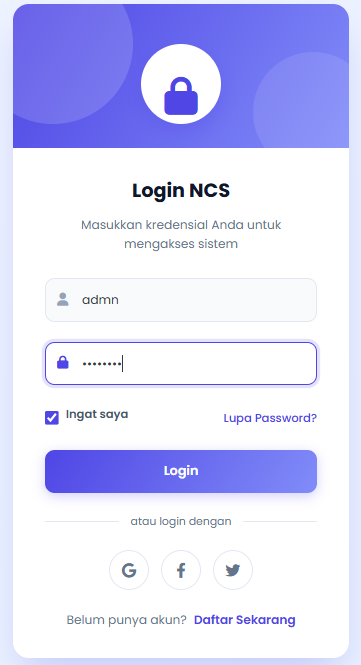
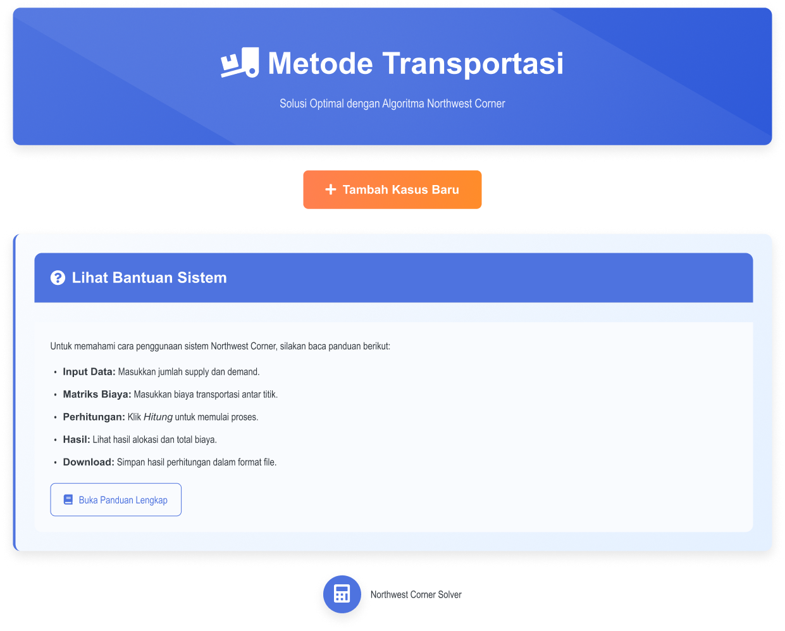
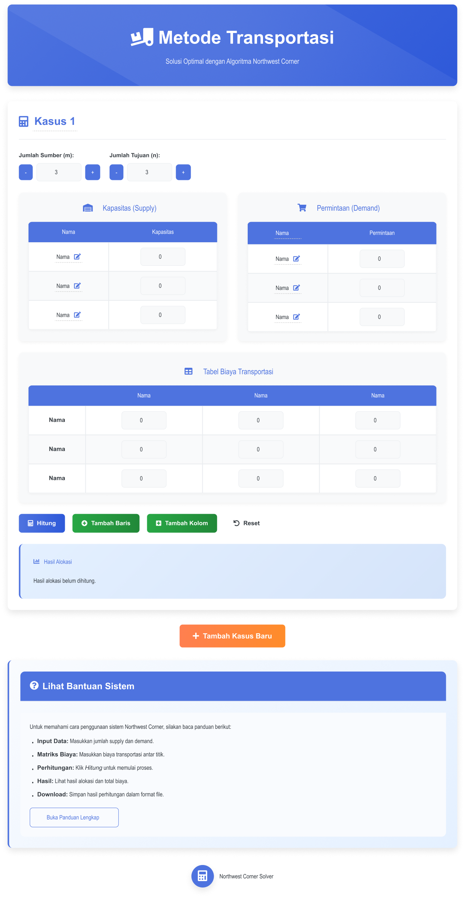
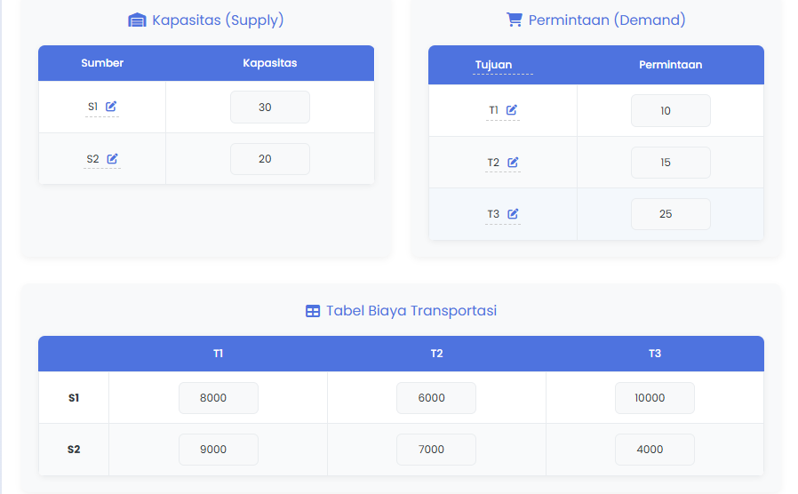
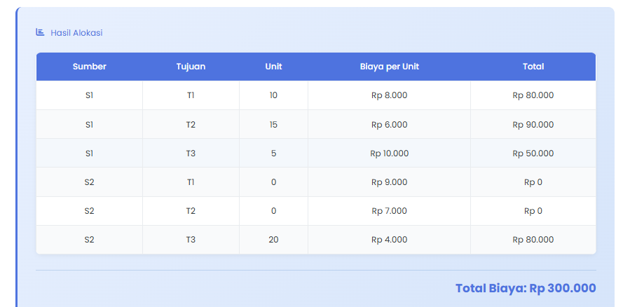

# Sistem Penghitungan Biaya Transportasi – Metode Northwest Corner

    <a href="#tujuan">Tujuan</a>
    <a href="#fitur">Fitur</a>
    <a href="#teknologi">Teknologi</a>
    <a href="#tampilan">Tampilan</a>
    <a href="#instalasi">Instalasi</a>
    <a href="#kontributor">Kontributor</a>

---

<section id="tujuan">
    

        <h2>🧭 Tujuan Proyek</h2>
        <ul style="list-style:disc;padding-left:24px;font-size:1.05rem">
            <li>Mengotomatisasi perhitungan alokasi distribusi barang</li>
            <li>Menyediakan antarmuka input yang fleksibel dan intuitif</li>
            <li>Menghasilkan tabel alokasi dan total biaya transportasi</li>
            <li>Menyediakan fitur ekspor hasil ke PDF dan CSV</li>
        </ul>
    

</section>

---

<section id="fitur" style="background:#fff">
    

        <h2>🔧 Fitur Utama</h2>
        

            

                <h3>📊 Input Data</h3>
                <ul>
                    <li>Input Supply &amp; Demand</li>
                    <li>Matriks Biaya Transportasi</li>
                    <li>Validasi data (supply = demand)</li>
                </ul>
            

            

                <h3>🧮 Perhitungan Otomatis</h3>
                <ul>
                    <li>Metode Northwest Corner</li>
                    <li>Tabel hasil alokasi</li>
                    <li>Total biaya transportasi</li>
                </ul>
            

            

                <h3>💾 Ekspor Data</h3>
                <ul>
                    <li>Ekspor ke PDF</li>
                    <li>Ekspor ke CSV</li>
                    <li>Tombol reset data</li>
                </ul>
            

        

    

</section>

---

<section id="teknologi">
    

        <h2>⚙️ Teknologi yang Digunakan</h2>
        

            
            
            
            
            
            
        

    

</section>

---

<section id="tampilan" style="background:#fff">
    

        <h2>🖼 Tampilan Sistem</h2>
        <h3>Halaman Login</h3>
        

            
        

        <h3>Halaman Utama Transportasi</h3>
        

            
            
        

        <h3>Contoh Input &amp; Output</h3>
        

            
            
        

        <h3 style="margin-top:35px">Panduan Sistem</h3>
        

            
        

    

</section>

---

<section id="instalasi">
    

        <h2>🛠 Instalasi &amp; Menjalankan Proyek</h2>
        <pre style="background:#2d2d2d;color:#f1f1f1;padding:5px;border-radius:var(--radius);overflow-x:auto">

            
## Clone repositori
    git clone https://github.com/Andrew2509/PROGRAM-PENGHITUNG-TRANPORTASI-DENGAN-METODE-NORTWEST-CORNER.git
 
    cd PROGRAM-PENGHITUNG-TRANPORTASI-DENGAN-METODE-NORTWEST-CORNER 

## Install dependencies
    composer update

    composer install
 
    npm install && npm run dev

## Konfigurasi environment
    cp .env.example .env
    
    php artisan key:generate

## Setup database
    php artisan migrate --seed
    
## Jalankan server
    php artisan serve
    
</pre>
    
Akses <code>http://localhost:8000</code>

     <table>
            <thead>
                <tr>
                    <th>Username</th>
                    <th>Password</th>
                </tr>
            </thead>
            <tbody>
                <tr>
                    <td>admin</td>
                    <td>12345678</td>
                </tr>
            </tbody>
        </table>
        

</section>

---

<section id="kontributor" style="background:#fff">
    

        <h2>👨‍💻 Kontributor</h2>
        <table>
            <thead>
                <tr>
                    <th>Nama</th>
                    <th>NIM</th>
                    <th>Peran</th>
                </tr>
            </thead>
            <tbody>
                <tr>
                    <td>Princenton Andrew Brightly Masrikat</td>
                    <td>1462100248</td>
                    <td>Desain Input &amp; Tampilan</td>
                </tr>
                <tr>
                    <td>Nouval B. Saputra</td>
                    <td>1462100264</td>
                    <td>Logika Algoritma &amp; Output</td>
                </tr>
            </tbody>
        </table>
    

</section>

---

## 📜 Lisensi

    Proyek ini dibuat untuk keperluan akademik (UAS Pengujian Perangkat Lunak) dan tidak dimaksudkan untuk digunakan di lingkungan produksi.

---

    © 2025 Sistem Penghitungan Biaya Transportasi – Metode Northwest Corner

